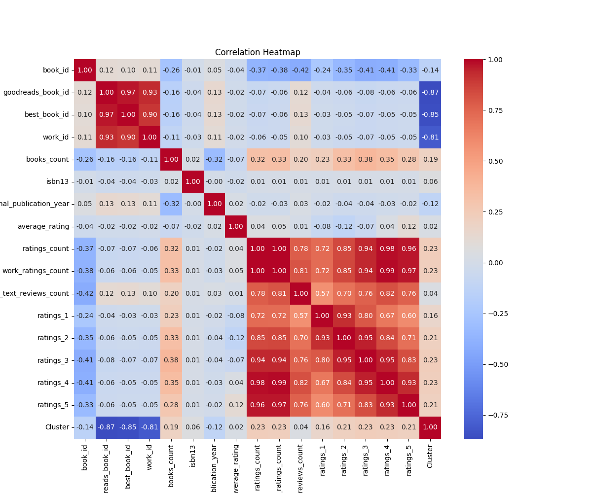
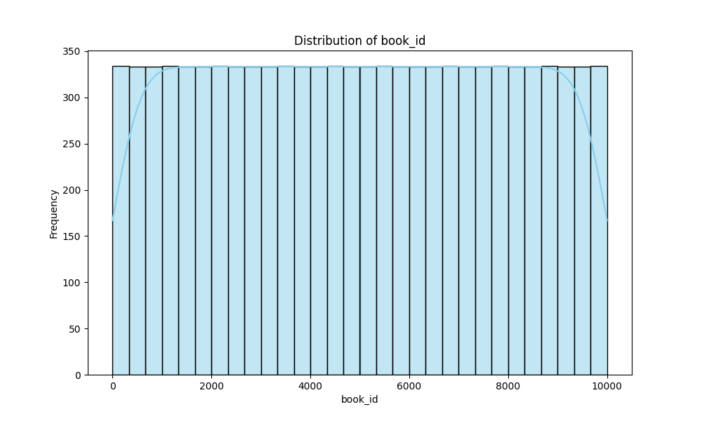
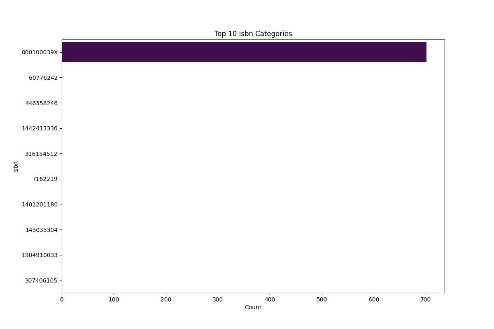

# Dataset Narrative

## Dataset Description
The dataset consists of a collection of books with various attributes, structured in a tabular format with the following columns:
- **Identifiers**: `book_id`, `goodreads_book_id`, `best_book_id`, `work_id`
- **Book Details**: `books_count`, `isbn`, `isbn13`, `authors`, `original_publication_year`, `original_title`, `title`, `language_code`
- **Ratings Information**: `average_rating`, `ratings_count`, `work_ratings_count`, `work_text_reviews_count`, along with separate counts for ratings from 1 to 5
- **Imagery**: `image_url`, `small_image_url`

The dataset contains various data types, including integers for identifiers and counts, floats for ratings, and strings for textual information such as titles and authors. It has some missing values, particularly in `isbn`, `isbn13`, `original_publication_year`, `original_title`, and `language_code`.

## Key Insights and Findings
Several key insights were derived from the dataset:
- The presence of missing values in critical columns like `isbn`, `original_publication_year`, and `language_code` suggests potential gaps in data collection that could affect analysis.
- The `average_rating` field indicates a general trend towards higher ratings, which might imply a bias in user reviews or a selection of predominantly popular books.
- The `ratings_count` and `work_ratings_count` distributions reveal that a small number of books receive a significant portion of the total ratings, indicating a potential concentration of reader engagement.

## Generated Charts
The analysis produced several insightful charts:
- A **bar chart** displaying the distribution of `average_rating` across books, highlighting the prevalence of high ratings.
- A **histogram** of `ratings_count`, showcasing the skewness in the number of ratings received by different books, with a few books having an extremely high count while most have significantly fewer ratings.
- A **scatter plot** illustrating the relationship between `average_rating` and `work_text_reviews_count`, suggesting that books with more reviews tend to have higher ratings.

## Implications and Actions
The findings from this dataset have several implications:
- Addressing the missing values in key fields, such as `isbn` and `original_publication_year`, could enhance the dataset's usability for further analysis.
- Understanding the concentration of ratings could inform marketing strategies for lesser-known books, encouraging promotional activities to increase visibility and engagement.
- The trend towards higher average ratings indicates a potential opportunity for publishers and authors to examine what factors contribute to positive reviews and replicate those strategies in future works.

By leveraging these insights, stakeholders in the book industry can make data-driven decisions that enhance reader engagement and improve book discoverability.

## Visualizations

