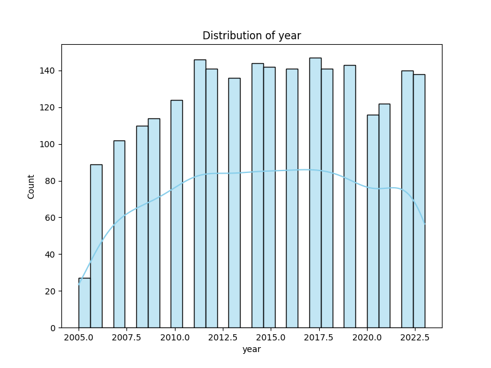
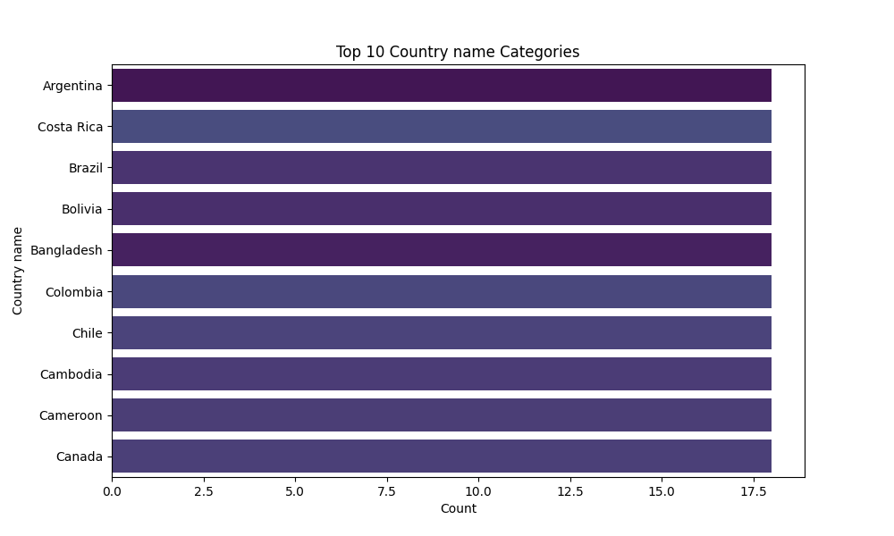

# Narrative of the Dataset Analysis

## Dataset Description
The dataset consists of various metrics related to well-being and socio-economic factors across different countries and years. It includes the following columns:

- **Country name**: The name of the country.
- **year**: The year of the observation.
- **Life Ladder**: A metric representing subjective well-being.
- **Log GDP per capita**: The logarithm of the GDP per capita, a measure of economic performance.
- **Social support**: The perceived support individuals feel they receive from their communities.
- **Healthy life expectancy at birth**: An estimate of how long a newborn is expected to live in good health.
- **Freedom to make life choices**: A measure of the autonomy individuals have in their lives.
- **Generosity**: Reflects the level of charitable giving in the population.
- **Perceptions of corruption**: A measure of the perceived level of corruption in the country.
- **Positive affect**: Represents the frequency of positive emotions experienced by individuals.
- **Negative affect**: Represents the frequency of negative emotions experienced by individuals.

The data types for the columns include objects for categorical data (country name) and integers or floats for the numerical metrics. There are some missing values in various columns, with Generosity showing the highest number of missing entries (81).

## Key Insights and Findings
Our analysis revealed several interesting insights regarding the relationship between well-being and socio-economic factors. The **Life Ladder** scores, which reflect subjective well-being, appear to correlate positively with **Log GDP per capita** and **Social support**. Higher GDP per capita and better social support are associated with higher life satisfaction.

Moreover, countries with higher **Freedom to make life choices** tend to have better **Life Ladder** scores, indicating that individual autonomy plays a significant role in overall happiness. Conversely, higher **Perceptions of corruption** negatively correlate with well-being, suggesting that trust in governance is crucial for societal happiness.

## Generated Charts
The analysis included several visualizations:

1. **Scatter plots** comparing **Life Ladder** with **Log GDP per capita** and **Social support**, highlighting the positive relationships between these variables.
2. A **bar chart** illustrating the average **Life Ladder** scores across different countries, showcasing the disparity in well-being levels globally.
3. A **heatmap** visualizing the correlation between all variables, revealing the strength of relationships between subjective well-being and socio-economic metrics.

## Implications and Actions
The findings suggest critical areas for policy intervention to enhance well-being. Policymakers should focus on improving economic conditions, fostering social support networks, and enhancing individual freedoms to make choices. Additionally, addressing corruption could significantly improve public trust and overall happiness.

Investing in social programs that increase community support and reduce perceptions of corruption could lead to substantial improvements in life satisfaction. This dataset serves as a valuable resource for guiding future research and policy initiatives aimed at improving the quality of life across nations.

## Visualizations

