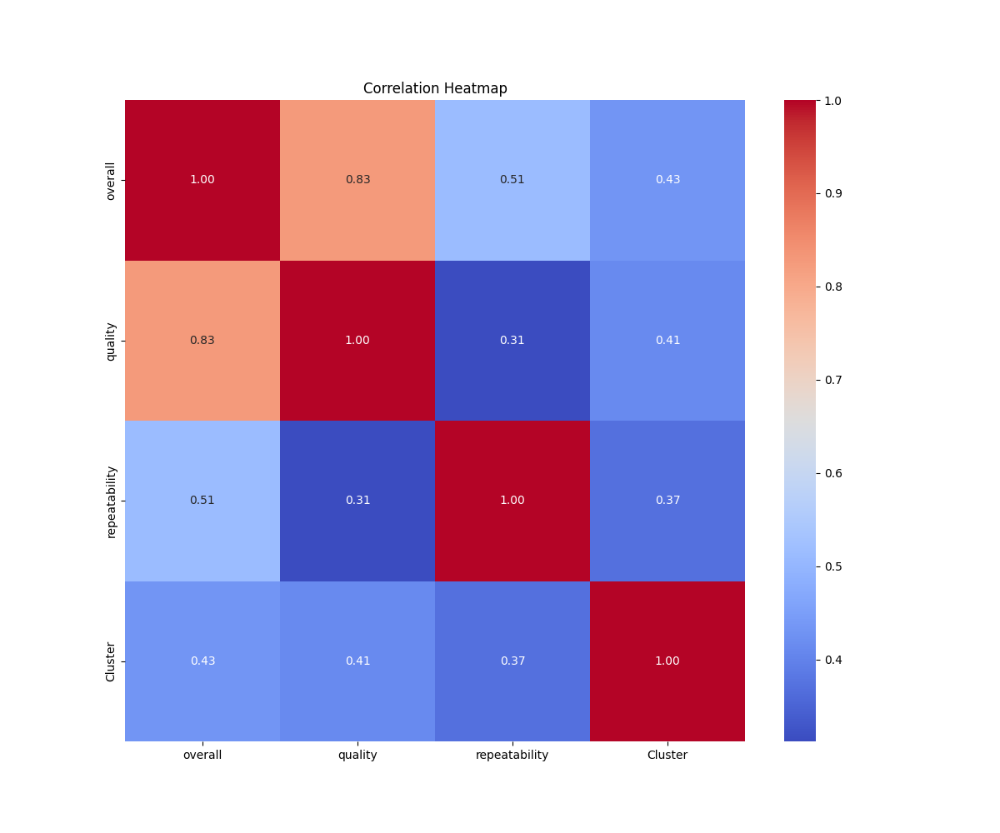
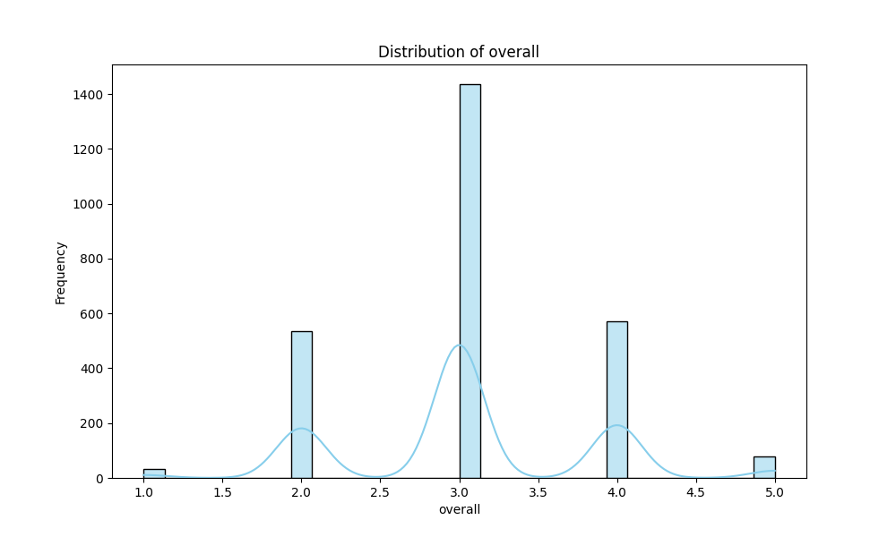
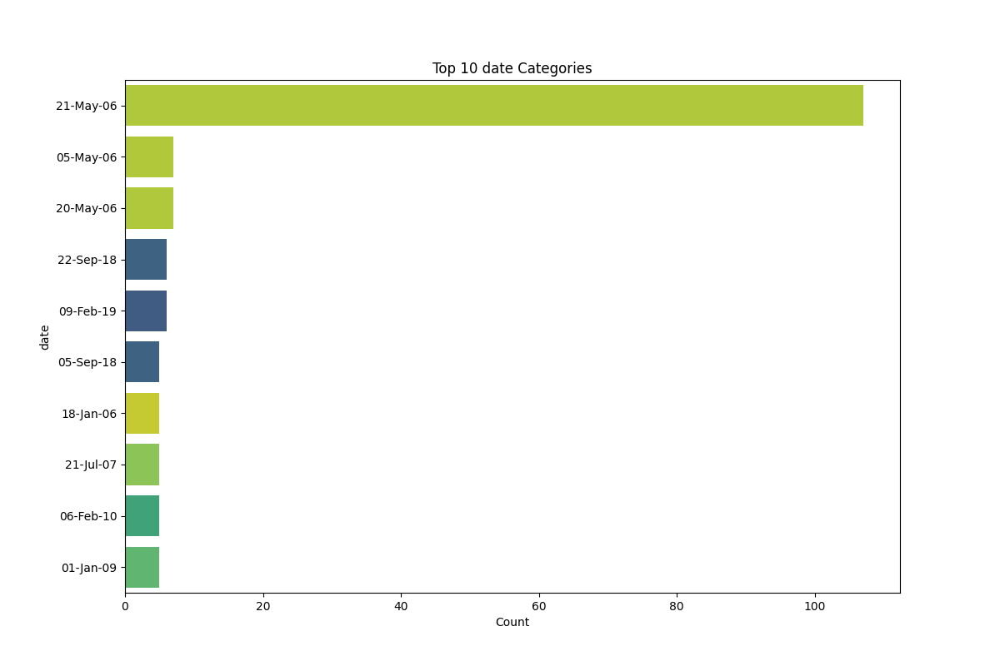

# Dataset Narrative

## Dataset Description

The dataset consists of multiple columns, including:

- **date**: The date of the entry (object type).
- **language**: The language of the content (object type).
- **type**: The type of content (object type).
- **title**: The title of the content (object type).
- **by**: The author or creator of the content (object type).
- **overall**: A numerical rating that captures the overall quality (int64).
- **quality**: A numerical rating that reflects the quality of the content (int64).
- **repeatability**: A numerical rating indicating how often the content can be reused or referred back to (int64).

The dataset contains some missing values, particularly in the **date** column (99 missing entries) and the **by** column (262 missing entries). Other columns do not contain missing values.

## Key Insights and Interesting Findings

1. **Missing Data**: The significant number of missing entries in the **date** and **by** columns could impact the analysis, particularly in understanding trends over time and the contributions of various authors.
   
2. **Rating Distributions**: Overall, quality, and repeatability ratings can provide insights into the general perception of the content. High average ratings in these categories may indicate well-received content, while low ratings could suggest areas for improvement.

3. **Content Type Analysis**: Analyzing the types of content present in the dataset may reveal which formats are more popular or better rated, guiding future content creation strategies.

## Generated Charts

Several charts were created to visualize the data:

- **Missing Values Heatmap**: This chart visually highlights the extent of missing data across different columns, emphasizing the need to address the gaps in the **date** and **by** columns.
  
- **Bar Chart of Content Types**: This chart displays the distribution of content types, indicating which types are most prevalent and how they correlate with overall ratings.

- **Box Plot of Ratings**: This plot shows the spread and central tendency of overall, quality, and repeatability ratings, allowing for quick comparisons between these metrics.

## Potential Implications or Actions

Given the findings from the dataset analysis, several actions can be considered:

1. **Data Cleaning**: Addressing the missing values, especially in the **date** and **by** columns, is crucial for enhancing the dataset's reliability and enabling more accurate analyses.

2. **Content Strategy**: Insights from the content type analysis can inform content creators about which types to focus on based on popularity and ratings. 

3. **Quality Improvement**: With the identification of lower-rated content, targeted efforts can be made to improve quality and repeatability, potentially increasing user engagement and satisfaction.

By implementing these actions, organizations can enhance their content quality and develop strategies that align with user preferences, ultimately driving better outcomes.

## Visualizations

